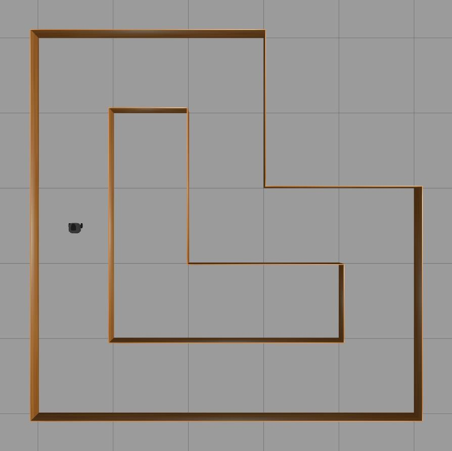
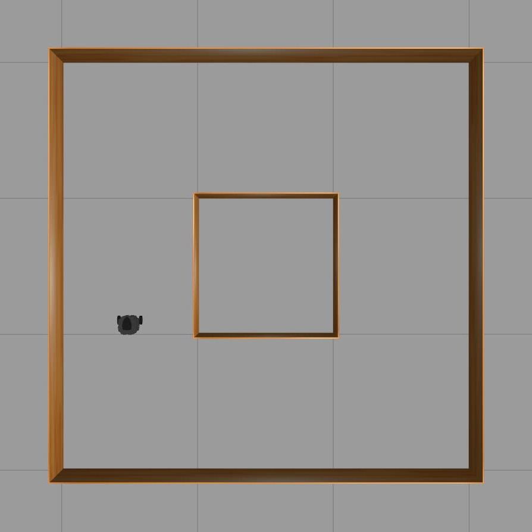
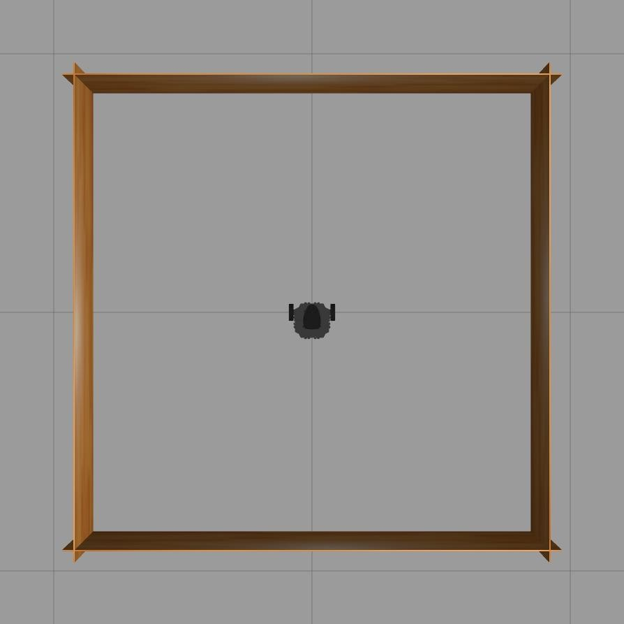
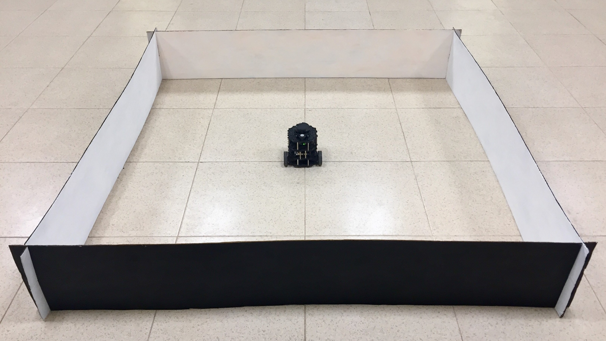

# TurtleBot3


To aggregate these simulations copy the folder `turtlebot3_gazebo` to your `turtlebot3_simulations` folder to merge the files.

## Gazebo stages

`turtlebot3_circuit_left_right_turns`: a 5x5 stage based on the gym-gazebo  GazeboCircuit2TurtlebotLidar env.

```
roslaunch turtlebot3_gazebo turtlebot3_circuit_left_right_turns.launch
```



`turtlebot3_circuit_simple`: a 3x3 stage.

```
roslaunch turtlebot3_gazebo turtlebot3_circuit_simple.launch
```



`turtlebot3_stage_1_eavelar`: a 1.8x1.8 stage based on the turtlebot3_stage_1.

```
roslaunch turtlebot3_gazebo turtlebot3_stage_1_eavelar.launch
```



This is a simple stage for simple real tests.


